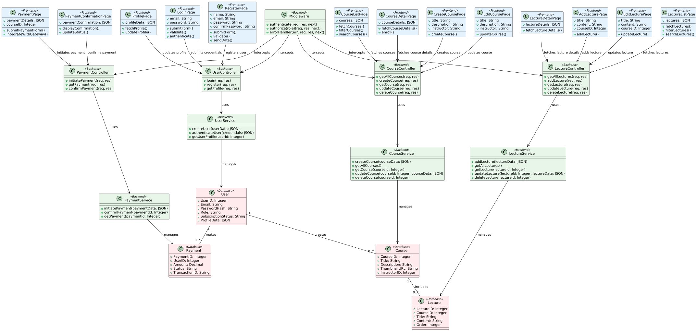

# Coursify (Learning Management System)

This repository contains the source code and implementation of a Learning Management System (LMS) developed using the MERN stack (MongoDB, Express.js, React, Node.js). The project leverages Tailwind CSS and DaisyUI for styling, providing a modern and responsive user interface. Media management is handled through Cloudinary, enabling seamless upload and retrieval of content. Additionally, Razorpay is integrated for subscription management, allowing users to access premium features through a secure and efficient payment gateway.This application also supports Progressive Web App (PWA) functionality, allowing users to install it on their desktop or mobile devices as a standalone app. This ensures a seamless experience with offline capabilities and quick access directly from the home screen.

## Live Project

You can access the live project here: [Coursify Live](https://coursify-lms.netlify.app)


## Table of Contents

- [Overview](#overview)
- [Tech Stack](#tech-stack)
- [Features](#features)
- [Prerequisites](#prerequisites)
- [Installation](#installation)
  - [Setup instruction for Frontend](#setup-instruction--for-frontend)
  - [Setup instruction for Backend](#setup-instruction--for-backend)
- [Low Level Diagram](#low-level-diagram)

## Overview

The Learning Management System (LMS) is a web-based application that facilitates the management and delivery of educational content and training materials. It allows administrators to create courses, manage users, and track progress. Users can access courses, view content, and complete assessments. Additionally, it offers subscription management through Razorpay, allowing users to purchase and cancel subscriptions.
This application also supports Progressive Web App (PWA) functionality, allowing users to install it on their desktop or mobile devices as a standalone app. This ensures a seamless experience with offline capabilities and quick access directly from the home screen.

## Tech Stack

The project utilizes the following technologies:

- **Frontend**:
  - **React**: For building the user interface and managing the application state.
  - **Tailwind CSS**: For styling the application with a modern and responsive design.
  - **DaisyUI**: A Tailwind CSS component library for pre-designed UI components.

- **Backend**:
  - **Node.js**: For building the server-side application.
  - **Express.js**: A web framework for handling API requests and routing.

- **Database**:
  - **MongoDB**: For storing user data, course information, and other application data.

- **Authentication**:
  - **JWT (JSON Web Tokens)**: For secure user authentication and session management.

- **Media Management**:
  - **Cloudinary**: For uploading, storing, and retrieving media files such as videos and images.

- **Payment Integration**:
  - **Razorpay**: For handling subscription payments and managing premium features.

- **Email Service**:
  - **SMTP**: For sending emails through the contact form and other notifications.

- **DevOps**:
  - **CORS**: For enabling cross-origin requests between the frontend and backend.
  - **Environment Variables**: For securely managing sensitive information like API keys and secrets.

Each technology is carefully chosen to ensure a seamless and efficient user experience while maintaining scalability and security.


## Features

- **User Authentication**: Secure user registration and login functionality using JWT-based authentication.

- **Course Management**: 
  - Administrators can create, update, and delete courses.
  - Courses can include videos and documents.

- **User Roles**: Role-based access control for administrators and students.

- **Responsive Design**: Fully responsive UI built with Tailwind CSS and DaisyUI for seamless usage across devices.

- **Media Management**: Integration with Cloudinary for efficient media upload, storage, and retrieval.

- **Subscription Plans**: 
  - Users can view and purchase subscription plans.
  - Razorpay integration ensures secure payment processing.

- **Contact Us**: Built-in contact form for user queries, integrated with SMTP for email delivery.

- **Progressive Web App (PWA)**: 
  - Installable on desktop and mobile devices for a native app-like experience.
  - Offline capabilities for accessing content without an internet connection.
  - Quick access directly from the home screen.

## Prerequisites

Before running this project locally, ensure you have the following :

- **Node.js**: Ensure you have Node.js installed (version 14.x or later recommended).
- **MongoDB**: A running instance of MongoDB for database operations.
- **npm**: Node Package Manager for managing dependencies.
- **Cloudinary Account**: For media management and storage.
- **Razorpay Account**: For subscription and payment integration.

## Installation

 Clone the project 

```bash
https://github.com/amanhaidry/Coursify.git
```

### Setup instruction  for Frontend

1. Move into the directory

```bash
cd Client
```
2. install  dependenices

```bash
npm install
```
3.  run the server

```bash
npm run dev
```

### Setup instruction  for Backend

1. Move into the directory

```bash
cd Server
```
2. install  dependenices

```bash
npm install
```


3.  Set up environment variables:
   Create a `.env` file in the `server` directory and add the following:

```bash
    PORT = <Port number >
    MONGODB_URL=<Connection_LINK>
    JWT_SECRET = <YOUR_LONG_JWT_SECRET>
    JWT_EXPIRY = <JWT_EXPIRY>

    FRONTEND_URL = <YOUR_FRONTEND_WEBSITE_URL>

    CONTACT_US_EMAIL = <YOUR_CONTACT_US_EMAIL>

    CLOUDINARY_CLOUD_NAME = <YOUR_CLOUDINARY_CLOUD_NAME>
    CLOUDINARY_API_KEY = <YOUR_CLOUDINARY_API_KEY>
    CLOUDINARY_API_SECRET = <YOUR_CLOUDINARY_API_SECRET>

    SMTP_HOST = <YOUR_SMTP_HOST>
    SMTP_PORT = <YOUR_SMTP_POST>
    SMTP_USERNAME = <YOUR_SMTP_USERNAME>
    SMTP_PASSWORD = <YOUR_SMTP_PASSWORD>
    SMTP_FROM_EMAIL = <YOUR_SMTP_FROM_EMAIL>

    RAZORPAY_KEY_ID = <YOUR_RAZORPAY_KEY>
    RAZORPAY_SECRET = <YOUR_RAZORPAY_SECRET>
    RAZORPAY_PLAN_ID = <YOUR_RAZORPAY_PLAN_ID>
```

### Important Note :

 * CORS Configuration in Backend (app.js):
     - Ensure that the backend application has properly configured CORS to allow requests from the frontend's origin.
     - Example: Use the `cors` middleware to set the allowed origin(s) in the backend.
       ```
       const cors = require('cors');
       app.use(cors({ origin: 'http://your-frontend-url.com' }));
       ```
 
  * Backend URL in Frontend (Axios):
     - Verify that the Axios instance or API calls in the frontend are pointing to the correct backend URL.
     - Example:
       ```
       const axiosInstance = axios.create({
         baseURL: 'http://your-backend-url.com/api',
       });
       ```
  
  * MongoDB IP Whitelisting:
     - Ensure that the current IP address of the server or development machine is whitelisted in MongoDB.
     - For MongoDB Atlas, go to the Network Access section and add the IP address or use `0.0.0.0/0` for all IPs (not recommended for production).
  

3.  run the server

```bash
npm run dev
```

## Low Level Diagram

---

## Project Showcase

### Home Page


## Deployment & Branches

This project is organized into multiple repositories and branches to facilitate local development and deployment across different platforms:

1. **Main Repository**:
  - The main branch contains the raw code files for both the client and server sides. This branch is designed for local development and testing. Deployment-specific changes (e.g., environment variables, configurations) should be made according to the target deployment platform.

2. **Server-Side Deployment**:
  - For server-side deployment, refer to the `coursify-onrender` branch. This branch is specifically configured for deployment on [Render](https://render.com). It includes the necessary server-side files and configurations for hosting the backend.

3. **Client-Side Deployment**:
  - For client-side deployment, refer to the `coursify-static-onrender` branch. This branch is configured to deploy the frontend as a static site on Render. It includes optimized build files and deployment-specific settings.

4. **Progressive Web App (PWA)**:
  - If you want to create a Progressive Web App (PWA) version of the client side, refer to the `coursify-pwa` branch. This branch includes additional configurations and files required to enable PWA functionality, such as service workers and a manifest file.

Each branch is tailored to its specific purpose, ensuring a streamlined workflow for development, deployment, and PWA support.

---

Happy Coding...